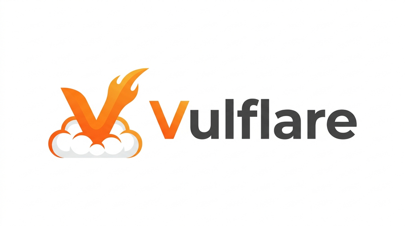

# Vulflare - Vulnerability Management Platform

<p align="center">
  
</p>

[](https://github.com/ikech4n/vulflare/actions/workflows/ci.yml)
[](LICENSE)

Cloudflare 技術スタックのみで構築した、OSS の脆弱性管理プラットフォームです。

## デモ

**URL:** https://vulflare.pages.dev

以下のデモアカウントでログインしてお試しいただけます。

| ユーザー名 | パスワード  | ロール                 |
| ---------- | ----------- | ---------------------- |
| `demo`     | `Demo1234!` | viewer（読み取り専用） |

## 主な機能

- **脆弱性ダッシュボード** — CVE の一覧・フィルタリング・ステータス管理
- **自動データ取得** — JVN から毎時自動取得（増分同期）、EOL 情報は毎日 01:00 JST に同期
- **EOL 追跡** — プロダクト・バージョンの End of Life を監視
- **ロールベースアクセス制御** — 管理者 / 一般ユーザーの権限管理
- **通知システム** — 脆弱性アラート・EOL アラート
- **AI 分析・対処レポート** — Cloudflare Workers AI を使用して脆弱性の分析レポートと対処方法を自動生成（モデルは `wrangler.toml` の `AI_MODEL` 環境変数で変更可能）
- **パッケージ監査** — ロックファイルアップロード or `npm audit --json` 結果を OSV.dev と照合して脆弱性を検出。CI/CD に組み込み可能な CLI ツール（`@vulflare/cli`）付き
- **Web脆弱性スキャナー** — URLを登録するだけでセキュリティヘッダー不備・機密ファイル露出・古いライブラリ・CSRF/オープンリダイレクト等 10 種類の受動的脆弱性スキャンを自動実行

## 技術スタック

| レイヤー        | 技術                                                    |
| --------------- | ------------------------------------------------------- |
| Frontend        | React 19 + Vite + TypeScript + TailwindCSS              |
| Backend API     | Cloudflare Workers + Hono                               |
| Database        | Cloudflare D1 (SQLite)                                  |
| Cache/Sessions  | Cloudflare KV                                           |
| Background Jobs | Cloudflare Scheduled Workers                            |
| AI              | Cloudflare Workers AI (llama-3.3-70b-instruct-fp8-fast) |

## セットアップ

### 前提条件

- Node.js 20 以上
- pnpm 9 以上
- Cloudflare アカウント

### 1. 依存関係インストール

```bash
pnpm install
```

### 2. 設定ファイルを準備

```bash
cp wrangler.toml.example wrangler.toml
cp .dev.vars.example .dev.vars
```

### 3. Cloudflare リソース作成

```bash
# D1 データベース
npx wrangler d1 create vulflare-db

# KV Namespaces
npx wrangler kv namespace create KV_SESSIONS
npx wrangler kv namespace create KV_CACHE
```

取得した ID を `wrangler.toml` の各プレースホルダー（`YOUR_D1_DATABASE_ID` など）に設定してください。
また、`wrangler.toml` の `YOUR_PROJECT_NAME` を Cloudflare Pages のプロジェクト名に変更してください。

### 4. 環境変数設定

`.dev.vars` を編集して `JWT_SECRET` を設定してください。

### 5. DB マイグレーション

```bash
pnpm db:migrate
```

### 6. 開発サーバー起動

```bash
# Worker（ポート 8787）
pnpm dev:worker

# Web（ポート 5173）— 別ターミナルで
pnpm dev:web
```

## npm audit CLI ツール

`npm audit --json` の結果を Vulflare に直接インポートできる CLI ツール（`@vulflare/cli`）が含まれています。

### 使い方

```bash
# 新規プロジェクトとして登録
npm audit --json | node packages/cli/dist/index.js \
  --url https://your-worker.workers.dev \
  --token <JWT> \
  --name "my-project"

# 既存プロジェクトに結果を追加
npm audit --json | node packages/cli/dist/index.js \
  --url https://your-worker.workers.dev \
  --token <JWT> \
  --project-id <uuid>
```

| オプション     | 説明                                        |
| -------------- | ------------------------------------------- |
| `--url`        | Vulflare Worker の URL（必須）              |
| `--token`      | JWT 認証トークン（必須）                    |
| `--name`       | 新規プロジェクト名（`--project-id` と排他） |
| `--project-id` | 既存プロジェクト ID（`--name` と排他）      |

### API エンドポイント直接利用

```bash
npm audit --json | curl -s -X POST \
  https://your-worker.workers.dev/api/audit/import-npm-audit \
  -H "Authorization: Bearer <JWT>" \
  -H "Content-Type: application/json" \
  -d @- <<< "$(cat -)"
```

または jq を使う場合:

```bash
npm audit --json > audit.json
curl -X POST https://your-worker.workers.dev/api/audit/import-npm-audit \
  -H "Authorization: Bearer <JWT>" \
  -H "Content-Type: application/json" \
  -d "$(jq -n --argjson audit "$(cat audit.json)" '{name:"my-project",npmAuditOutput:$audit}')"
```

## デプロイ

```bash
# Worker デプロイ
pnpm deploy:worker

# Web（Cloudflare Pages）デプロイ
pnpm deploy:web
```

詳細なデプロイ手順は [CONTRIBUTING.md](CONTRIBUTING.md) を参照してください。

## Cloudflare API トークンの権限

`wrangler deploy` や CI/CD からデプロイする際に使用する API トークンには、以下の権限が必要です。

### Worker デプロイ用トークン

| リソース                          | 権限 | 用途                                    |
| --------------------------------- | ---- | --------------------------------------- |
| Account > Workers Scripts         | Edit | Worker のデプロイ・更新                 |
| Account > D1                      | Edit | D1 データベースの作成・マイグレーション |
| Account > KV Storage              | Edit | KV Namespace の作成・データ操作         |
| Account > Email Routing Addresses | Read | Send Email バインディングの利用         |

> **注意:** Email Routing の Send Email バインディングを使用するには、対象ドメインで Cloudflare Email Routing が有効になっている必要があります。

### Pages デプロイ用トークン

| リソース                   | 権限 | 用途                         |
| -------------------------- | ---- | ---------------------------- |
| Account > Cloudflare Pages | Edit | Pages プロジェクトのデプロイ |

### カスタムドメインを使用する場合（任意）

| リソース              | 権限 | 用途                                 |
| --------------------- | ---- | ------------------------------------ |
| Zone > Workers Routes | Edit | カスタムドメインへのルーティング設定 |

### API トークンの作成手順

1. [Cloudflare ダッシュボード](https://dash.cloudflare.com/profile/api-tokens) → **API Tokens** → **Create Token**
2. **Create Custom Token** を選択
3. 上記の権限を追加してトークンを作成
4. 作成したトークンを環境変数 `CLOUDFLARE_API_TOKEN` に設定

## コントリビュート

コントリビューションを歓迎します！詳細は [CONTRIBUTING.md](CONTRIBUTING.md) を参照してください。

## セキュリティ

セキュリティ脆弱性を発見した場合は、[SECURITY.md](SECURITY.md) の手順に従って報告してください。

## ライセンス

[Apache License 2.0](LICENSE)
